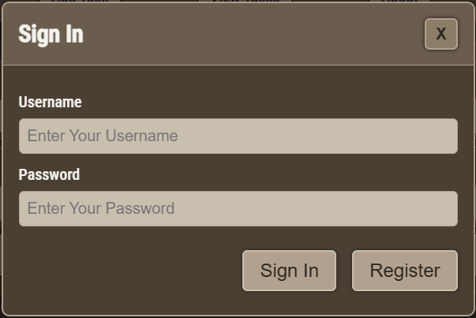
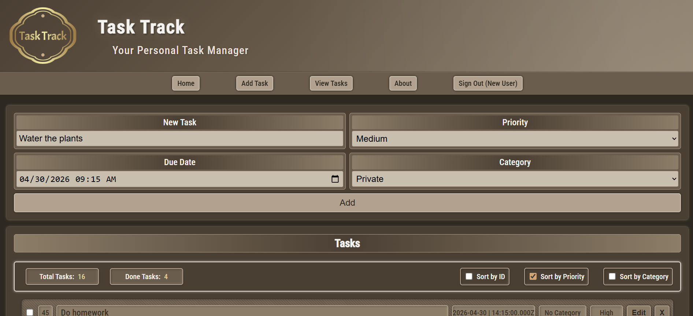

# Task Track


<p align="center">
  
</p>

<p align="center">
  
</p>

## Beskrivning

Task Track är en komplett fullstack-applikation för att hantera personliga uppgifter (to-dos). Backend är byggd i Express (Node.js) och använder Azure SQL Database för lagring av användare och uppgifter. Frontend är en ren HTML/CSS/JS-klient som körs som statisk resurs på Azure Web App. Systemet stödjer inloggning/utloggning, skapande/redigering/borttagning av uppgifter, markering som klara, sortering, kategorier och deadlines med visuella varningar när 1 dag eller 1 timme återstår.

**Arkitektur och Azure-integration:**

- **Databas:** Alla användare och uppgifter lagras i en Azure SQL Database istället för lokala JSON-filer.
- **Key Vault:** Hemligheter som `SESSIONSECRET` och `SqlConnectionString` hämtas säkert från Azure Key Vault (`kv-task-track`).
- **Deployment:** Applikationen är anpassad för Azure Web App och kan deployas automatiskt med `Deploy.ps1` (PowerShell-script) som zippar och laddar upp koden.
- **Sessions:** Sessionscookies används för autentisering. API:t är uppdelat i auth-endpoints och tasks-endpoints. Frontenden kommunicerar med API:t via fetch-anrop och renderar listor, formulär och notifieringar direkt i DOM.

**Backend-exponering:**

- Autentisering (`/api/auth/*`): Registrering hashar lösenord med bcryptjs (cost 10) och sparar användare i Azure SQL. Inloggning verifierar hash och sätter en sessionscookie (`sid`). Utloggning tar bort sessionen. `GET /api/auth/me` returnerar inloggad användare eller `401` om ingen session finns.
- Uppgifter (`/api/tasks`): Alla endpoints är skyddade bakom session. Uppgifterna sparas per användare i tabellen `tasks` i Azure SQL. Skapa (`POST`) kräver minst `taskText`. Uppdatera (`PATCH /:id`) validerar fält: `priority` måste vara en av `Low|Medium|High`, `category` en av `Private|Work|School|No Category`, och `deadline` måste följa formatet `YYYY-MM-DDTHH:MM` eller vara `null`. Borttagning (`DELETE /:id`) tar bort uppgiften.

Frontenden (under `public/`) presenterar ett enkelt UI:

- Startsida med formulär för ny uppgift (text, prioritet, deadline, kategori) och en lista med befintliga uppgifter.
- Inloggningsmodal med växling mellan "Sign In" och "Register"; efter inloggning ändras nav-länken till "Sign Out (username)".
- Sorteringsalternativ: efter ID, prioritet eller kategori; default-sortering är efter närmaste deadline.
- Visuella indikatorer: uppgifter inom 1 dag eller 1 timme markeras (klasser `one-day-left`, `one-hour-left`), utgången deadline markeras med `Expired!`. När en uppgift markeras som klar visas en kort notifiering och notifieringar visas när en uppgift skapas, uppdateras, eller tas bort, så att användaren alltid får tydlig feedback på sina handlingar.

## Projektstruktur

```text

Task-Track/
├─ nodemon.json
├─ package.json
├─ README.md
├─ server.js
├─ Deploy.ps1
├─ public/
│  ├─ 404.html
│  ├─ about.html
│  ├─ index.html
│  ├─ index.js
│  └─ styles.css

```

## English Summary

Task Track is a `Node.js` and `Express` app with a static frontend. Users can register/login, then create, edit, delete and mark tasks as done. All data is stored in Azure SQL Database. Secrets are managed via Azure Key Vault.

## Lokal utveckling

För att köra projektet lokalt måste du skapa en `.env`-fil i projektroten med följande innehåll:

```env
SESSIONSECRET=din-super-hemliga-sträng
SqlConnectionString=Server=tcp:task-track-server.database.windows.net,1433;Initial Catalog=Task-Track-DB;Persist Security Info=False;User ID=Task-Track-Admin;Password=DITT_LÖSENORD;MultipleActiveResultSets=False;Encrypt=True;TrustServerCertificate=False;Connection Timeout=30;
```

Byt ut värdena mot dina egna. Dessa variabler krävs för att backend ska starta lokalt.

Run locally:

```bash
cd Task-Track-Azure
npm install
npm run dev
```

Or start without nodemon:

```bash
npm start
```

**Deploy to Azure Web App:**

1. Se till att Azure-resurser är skapade: SQL Database, Key Vault (`kv-task-track`), och Web App.
2. Lägg in hemligheterna `SESSIONSECRET` och `SqlConnectionString` i Key Vault.
3. Kör deploymentscriptet:

```powershell
./Deploy.ps1
```

Scriptet packar och laddar upp koden till din Azure Web App.

## Huvudmeny

Webbgränssnittet innehåller:

- Home – Startsidan med uppgiftslistan
- Add Task – Formulär för att lägga till ny uppgift
- View Tasks – Scroll/sektion för alla uppgifter
- About – Statisk infosida
- Sign In / Sign Out – Inloggning/utloggning via modal

Status visas i UI:t: antal uppgifter totalt, antal klara, samt visualisering av deadlines. Notifieringar bekräftar åtgärder (t.ex. "Task Added!", "Task Deleted!").

## Sorterings- och filtreringsval

- Sort by ID – Sorterar efter uppgifts-ID
- Sort by Priority – Sorterar efter prioritet (High, Medium, Low)
- Sort by Category – Sorterar efter kategori (Private, Work, School, No Category)
- Default-sortering – Efter närmaste deadline

## Funktioner

- Autentisering: Registrering, inloggning, utloggning via sessionscookies
- Per-användarlagring: Uppgifter sparas i Azure SQL Database
- CRUD för uppgifter: Skapa, hämta, uppdatera (text, done, deadline, kategori, prioritet), ta bort
- Deadlines: Varningar för ≤1 dag kvar, ≤1 timme kvar, och utgången deadline (Expired!)
- Sortering och räkning: Antal totalt/klara; sortera efter ID/prioritet/kategori eller deadline
- Inline-redigering: Direktredigering av uppgift med "Save"/"Cancel"
- Notifieringar: Bekräftelser vid add/update/complete/delete

## Så här kör du programmet

1. Klona eller öppna projektet
2. Installera beroenden

```powershell
npm install
```

3. Starta utvecklingsserver:

```powershell
npm run dev
```

Alternativt start utan nodemon:

```powershell
npm start
```

## Vad användaren gör efter att programmet startar

- Inloggning: Klicka på "Sign In" i nav, använd modal för login/registrering
- Skapa uppgift: Fyll i text, prioritet, deadline och kategori, klicka "Add"
- Hantera uppgifter:
  - Markera som klar (checkbox)
  - Redigera ("Edit" → ändra → "Save"/"Cancel")
  - Ta bort ("X")
- Sortering: Kryssa i önskad sortering (ID/Priority/Category) eller kör default (deadline)
- Notifieringar: Bekräftelser visas kort i nederkant

## API-endpoints

Autentisering

- POST /api/auth/register – Skapar användare och loggar in
- POST /api/auth/login – Loggar in
- POST /api/auth/logout – Loggar ut
- GET /api/auth/me – Hämtar inloggad användare

Uppgifter (kräver inloggning)

- GET /api/tasks – Hämtar alla uppgifter för användaren
- POST /api/tasks – Skapar ny uppgift
- PATCH /api/tasks/:id – Uppdaterar uppgift (done, text, deadline, kategori, prioritet)
- DELETE /api/tasks/:id – Raderar uppgift

## Databasstruktur (Azure SQL)

Alla användare och uppgifter lagras i Azure SQL Database med två tabeller:

- **users**: id (PK), username (unik), passwordHash
- **tasks**: id (PK), userId (FK), taskText, priority, deadline, category, done

Tabellerna skapas automatiskt vid första körning om de inte finns.

## Utvecklare

Alaa Alsous

## Språk, Plattform, Verktyg

- Språk: JavaScript
- Plattform: Node.js / Express; Frontend: HTML/CSS/JS
- Databas: Azure SQL Database
- Hemligheter: Azure Key Vault
- Deployment: Azure Web App, PowerShell (Deploy.ps1)
- Verktyg: VS Code, Nodemon
